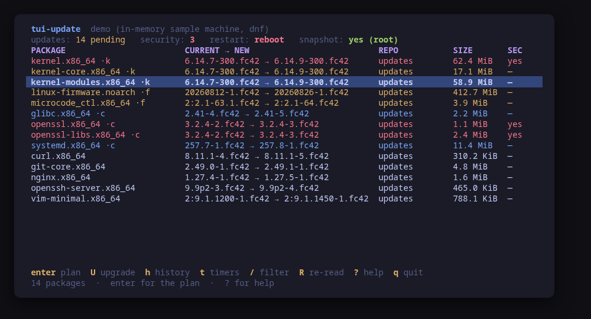
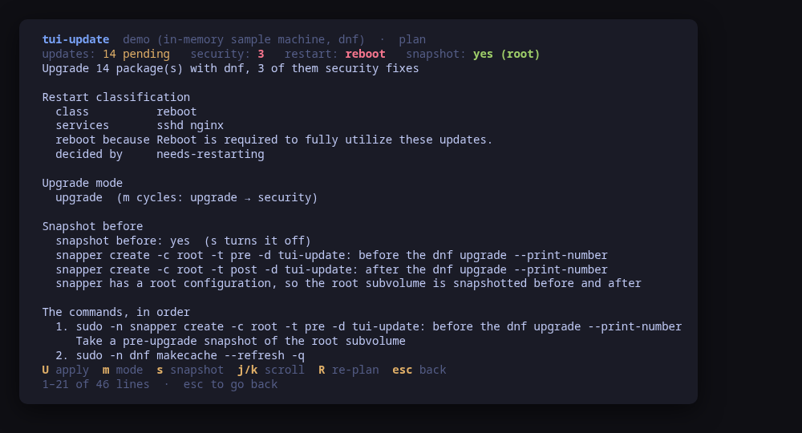
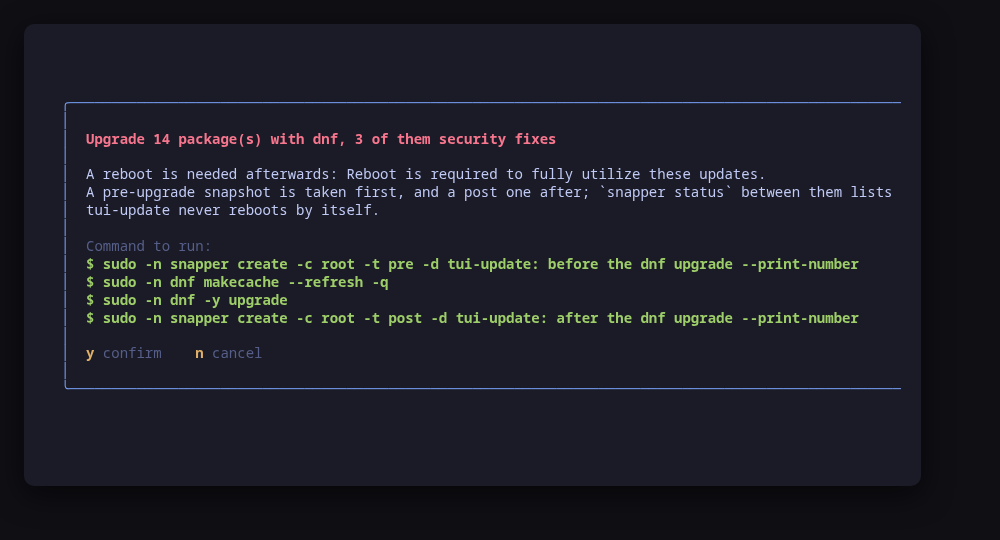
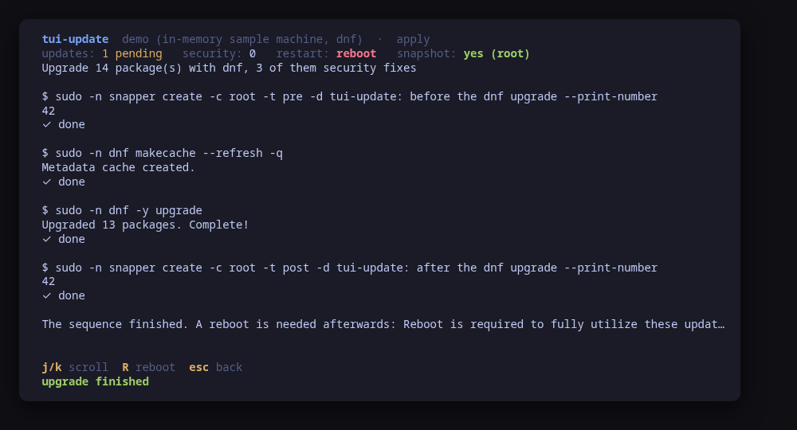
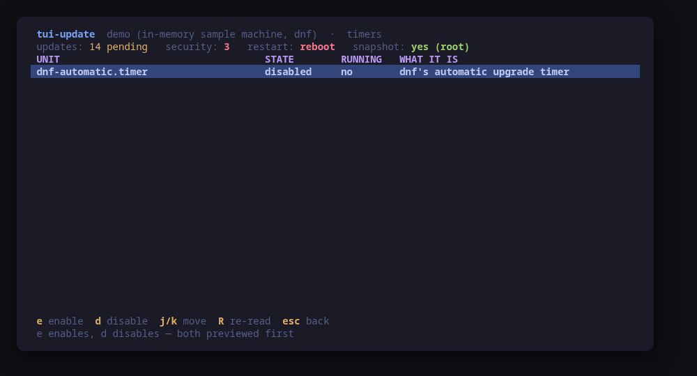
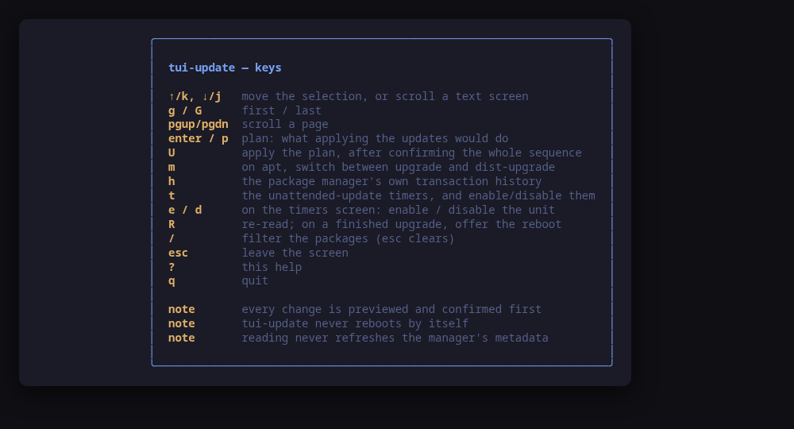

A terminal UI for the updates waiting on your machine. It reads them from
whichever package manager the machine actually runs — `pacman`, `apt` or `dnf` —
and answers the question a list of versions never does: **what will applying
this cost, and what has to restart afterwards?**

Every distribution ships a one-line upgrade command. None of them tells you, up
front, that the kernel in the list means a reboot, that `sshd` will keep the old
`openssl` mapped until it is restarted, or that a snapshot could have been taken
first. `tui-update` puts all of that on one screen, in the
[Omarchy](https://omarchy.org) visual style, and **previews the exact command
sequence before running it**.



> **Status: early, under validation.** An independent tool that follows the
> Omarchy visual style; it is **not** part of the Omarchy project and not
> endorsed by its maintainers. Expect rough edges.

## Install

<!-- install:start -->
<!-- Generated by tui-kit/tools/render-install.py from tool.json. -->
<!-- Edit the manifest, then run `make readme`. -->

### Any distribution, static binary

```sh
curl -fsSL https://github.com/tui-tools/tui-update/releases/download/v0.1.0/tui-update_0.1.0_linux_amd64.tar.gz | tar -xz tui-update
sudo install -m0755 tui-update /usr/local/bin/tui-update
```

One static binary. Verify it against checksums.txt from the same release.

### From source

```sh
git clone https://github.com/tui-tools/tui-update
cd tui-update && make build
sudo install -m0755 bin/tui-update /usr/local/bin/tui-update
```

Needs Go 1.27 or newer.

The distribution packages are not published yet. The commands below are here so
you know what they will be; a package repository at `pkgs.tui.tools` is what
turns them on.

### Arch Linux — coming soon

Needs the tui-tools repository, which is a [one-time
setup](https://tui-tools.github.io/install/).

The one-liner detects the distribution and adds the repository and its signing
key:

```sh
curl -fsSL https://pkgs.tui.tools/install.sh | sh
```

Piping a script into a shell is not this family's style, so here is the same
setup by hand — read it, or read the script first with `curl -fsSL
https://pkgs.tui.tools/install.sh -o install.sh`:

```sh
curl -fsSL -o /tmp/tui-tools.asc https://pkgs.tui.tools/pubkey.asc
sudo pacman-key --add /tmp/tui-tools.asc
sudo pacman-key --lsign-key \
  "$(gpg --show-keys --with-colons /tmp/tui-tools.asc | awk -F: '/^fpr:/{print $10; exit}')"
printf '[tui-tools]\nServer = https://pkgs.tui.tools/arch/$arch\n' \
  | sudo tee -a /etc/pacman.conf
sudo pacman -Sy
```

Then, and for every other tool in the family:

```sh
sudo pacman -S tui-update
```

Upgrades then arrive with the rest of your system updates.

### Arch Linux (AUR) — coming soon

```sh
paru -S tui-update-bin
```

The -bin package installs the released static binary.

### Debian and Ubuntu — coming soon

Needs the tui-tools repository, which is a [one-time
setup](https://tui-tools.github.io/install/).

The one-liner detects the distribution and adds the repository and its signing
key:

```sh
curl -fsSL https://pkgs.tui.tools/install.sh | sh
```

Piping a script into a shell is not this family's style, so here is the same
setup by hand — read it, or read the script first with `curl -fsSL
https://pkgs.tui.tools/install.sh -o install.sh`:

```sh
sudo install -d -m 0755 /etc/apt/keyrings
curl -fsSL https://pkgs.tui.tools/pubkey.asc \
  | sudo gpg --dearmor -o /etc/apt/keyrings/tui-tools.gpg
echo "deb [signed-by=/etc/apt/keyrings/tui-tools.gpg] https://pkgs.tui.tools/deb stable main" \
  | sudo tee /etc/apt/sources.list.d/tui-tools.list
sudo apt update
```

Then, and for every other tool in the family:

```sh
sudo apt install tui-update
```

Upgrades then arrive with the rest of your system updates.

### Fedora and RHEL — coming soon

Needs the tui-tools repository, which is a [one-time
setup](https://tui-tools.github.io/install/).

The one-liner detects the distribution and adds the repository and its signing
key:

```sh
curl -fsSL https://pkgs.tui.tools/install.sh | sh
```

Piping a script into a shell is not this family's style, so here is the same
setup by hand — read it, or read the script first with `curl -fsSL
https://pkgs.tui.tools/install.sh -o install.sh`:

```sh
sudo rpm --import https://pkgs.tui.tools/pubkey.asc
sudo curl -fsSL -o /etc/yum.repos.d/tui-tools.repo https://pkgs.tui.tools/rpm/tui-tools.repo
sudo dnf makecache
```

Then, and for every other tool in the family:

```sh
sudo dnf install tui-update
```

Upgrades then arrive with the rest of your system updates.

### openSUSE — coming soon

Needs the tui-tools repository, which is a [one-time
setup](https://tui-tools.github.io/install/).

```sh
sudo zypper install tui-update
```

The rpm repository is shared with dnf; zypper support is not tested yet.

### Verify a download

Every release of `tui-update` ships a `checksums.txt`. Check an archive against
it before installing:

```sh
sha256sum -c checksums.txt --ignore-missing
```
<!-- install:end -->

One static binary, no daemon, no state of its own. Nothing keeps running after
you quit.

## Try it without root

```sh
tui-update --demo
```

`--demo` runs against a sample machine: fourteen pending updates including a
kernel and two `openssl` security fixes, a reboot already required, `sshd` and
`nginx` holding old code open, and a `snapper` root configuration to snapshot
into. Every key works, every command is built and previewed for real, and
nothing touches your system.

## The plan is the point



`enter` on the pending list gives you the plan, and it is four answers:

- **The restart classification.** `none`, `services` with the list of units
  still holding replaced code open, or `reboot` with the reason. It comes from
  whatever on this machine can actually read the process table —
  `needrestart -b` on apt, `needs-restarting` on dnf,
  `omarchy-server-update-restart --dry-run` on Omarchy Server — and falls back
  to the package names when none of them answered. The screen always says which
  it was.
- **The snapshot.** `snapshot before: yes` with the exact
  `snapper create -c root -t pre …` that would run, or `no` with the reason:
  snapper is not installed, or it has no configuration covering `/`.
- **The manager's own dry run**, quoted: `apt-get -s upgrade`,
  `dnf upgrade --assumeno`. On pacman there is none that does not first
  synchronise the databases, which needs root, so the pending list stands in
  and the screen says so.
- **The whole command sequence**, in order, each line with what it does.

## Every change is previewed



`U` opens a confirm dialog carrying every command of the sequence. `y` runs
them, `n` does not. There is no other path to a change: the UI hands the same
values to the preview and to the runner, so what you read is what executes.

The sequence is run one command at a time, and the output streams into a pane
as each one answers, so a long download is visible rather than a frozen screen.

## It never reboots by itself



When the upgrade needed a reboot, the apply screen offers `R` afterwards — with
its own confirm dialog, naming the reason and warning that every session on the
machine ends there. Nothing in this tool starts a reboot without that.

## Unattended updates, made visible



`t` shows the machine's unattended-update mechanism and its real state:
`omarchy-server-update.timer`, `apt-daily-upgrade.timer` with
`unattended-upgrades.service`, or `dnf-automatic.timer`. `e` and `d` enable or
disable it, previewed like everything else — because a machine that upgrades
itself while nobody is watching is precisely the thing this tool exists to make
legible.

## Usage

```sh
tui-update                        # drive the real package manager
tui-update --demo                 # sample machine, no privileges needed
tui-update --check                # read the updates, print JSON, exit
tui-update --theme ~/mytheme/colors.toml
tui-update --sudo ""              # run the commands directly (as root)
tui-update --version
```

### `--check`, for scripts and tests

`--check` is the non-interactive read path: it loads the state through the same
backend the UI would use, prints it as JSON and exits 0, or exits 1 with the
reason if the manager cannot be read. No UI, and it never builds or runs a
mutation.

```console
$ tui-update --check | head -14
{
  "tool": "tui-update",
  "version": "0.1.0",
  "manager": "dnf",
  "distro": "fedora",
  "describe": "dnf via /usr/bin/sudo -n on fedora",
  "pending": 10,
  "security": 0,
  "rebootRequired": false,
  "restart": "none",
  "services": [],
  "snapshot": false,
  "timers": [
```

It exists so a test can assert on what the tool *parsed* rather than on what it
painted — that the count matches `dnf check-update`, that the reboot verdict
matches `needs-restarting -r`, that the timer state matches
`systemctl is-enabled`.

**It never refreshes the manager's metadata.** A refresh writes to a root-owned
cache, and the whole read path is built to work as an ordinary user against what
is already on disk. The smoke test asserts it on the cache's own mtime.

[tui-lab](https://github.com/tui-tools/tui-lab) uses it to test this tool
against real machines on Arch, Ubuntu and Fedora; the assertions live in
[`test/smoke.sh`](test/smoke.sh).

## What it can do to your machine

Every one of these is previewed and confirmed first.

| | What runs |
| --- | --- |
| snapshot before | `snapper create -c root -t pre -d "…" --print-number` |
| refresh (apt) | `apt-get update` |
| refresh (dnf) | `dnf makecache --refresh -q` |
| upgrade (pacman) | `pacman -Syu --noconfirm` |
| upgrade (Omarchy Server) | `omarchy-server-update run --no-reboot` |
| upgrade (apt) | `apt-get -y upgrade`, or `apt-get -y dist-upgrade` |
| upgrade (dnf) | `dnf -y upgrade` |
| snapshot after | `snapper create -c root -t post -d "…" --print-number` |
| timers | `systemctl enable --now <unit>` / `systemctl disable --now <unit>` |
| reboot | `systemctl reboot` |

Nothing else. No package is ever installed, removed or held by this tool: it
applies the upgrade the manager itself would apply, whole.

On Omarchy Server the upgrade goes through the machine's own wrapper rather than
straight to pacman, because that wrapper runs the same `pacman -Syu` and then
classifies and restarts what changed — driving pacman directly there would skip
half the job the machine was set up to do. `--no-reboot` is passed, since taking
the reboot is this tool's user's decision.

## Keys

| Key | Action |
| --- | --- |
| `↑`/`k`, `↓`/`j` | Move the selection, or scroll a text screen |
| `g` / `G` | First / last |
| `pgup` / `pgdn` | Scroll a page |
| `enter` / `p` | The plan: what applying the updates would do |
| `U` | Apply it, after confirming the whole sequence |
| `m` | On apt, switch between `upgrade` and `dist-upgrade` |
| `h` | The package manager's own transaction history |
| `t` | The unattended-update timers |
| `e` / `d` | On the timers screen: enable / disable the unit |
| `R` | Re-read; on a finished upgrade, offer the reboot |
| `/` | Filter the packages (matches any column; `esc` clears) |
| `esc` | Leave the screen |
| `?` | Help |
| `q` | Quit |



## What v0.1 can do

- Read the pending updates from `checkupdates` or `pacman -Qu`,
  `apt list --upgradable`, or `dnf check-update` — always from the metadata
  already on disk, never refreshing it.
- Show current → new, the repository, the download size where the manager
  publishes one, and the security flag where it publishes that, with kernel and
  firmware grouped to the top.
- Classify what an upgrade would leave behind: nothing, a list of services, or a
  reboot with its reason — from `needrestart`, `needs-restarting`,
  `/var/run/reboot-required`, `omarchy-server-update-restart`, or the package
  names when none of those could be read.
- Decide whether a `snapper` pre-upgrade snapshot is possible, and build the
  pre/post pair that makes `snapper status <pre>..<post>` list what changed.
- Preview and run the whole sequence — snapshot, refresh, upgrade, snapshot —
  one command at a time, with the output streaming into a pane.
- Offer the reboot afterwards, behind its own confirm dialog. Never take one.
- Show the manager's last 20 transactions from `/var/log/pacman.log`,
  `/var/log/apt/history.log` or `dnf history list`, read-only.
- Show and toggle the machine's unattended-update unit.
- Follow the active Omarchy theme, and respect `NO_COLOR`.

## What v0.1 cannot do

- **No per-package upgrade.** The list is not a selection: it is what the
  manager would do, and the tool applies that whole or not at all. Holding a
  package back is the manager's own job (`IgnorePkg`, `apt-mark hold`,
  `excludepkgs`) and this tool shows the result rather than changing it.
- **No rollback.** The snapshot is taken so that `snapper undochange` or a boot
  into the pre snapshot is *possible*; performing it is not a key here.
- **No per-package size on pacman or apt.** Neither `apt list --upgradable` nor
  `checkupdates` reports one, and asking for it would mean a second privileged
  read per package. The column is hidden there rather than filled with guesses.
- **No security flag on pacman.** Arch publishes no per-package security
  metadata, so the column reads `n/a` — which is a different claim from `no`.
- **No zypper, no apk, no nix, no flatpak, no snap.** The `updates.Backend`
  interface is where one would go; nothing in the UI names a package manager.
- **No AUR, no third-party helpers.** `paru` and `yay` are not driven.
- **No download-only, no partial upgrade, no `--exclude`.**

## Compatibility

<!-- compat:start -->
<!-- Generated by tui-kit/tools/render-compat.py from tool.json. -->
<!-- Edit the manifest, then run `make readme`. -->

`tui-update` probes its backend once at startup and shows the version in the
header. A version nobody has tested is marked `(untested)` there rather than
hidden; one below the minimum is marked as such and the tool still runs.

### pacman

| | |
| --- | --- |
| Binary | `pacman` |
| Version read with | `pacman --version` |
| Minimum | 6.0 |
| Tested | `7.1.0` |

| Versions | What changes |
| --- | --- |
| `>=6.0` | pacman publishes no security metadata, so no update is ever marked as a security fix here; the column reads `n/a` rather than `no` |
| `>=6.0` | there is no dry run that does not first synchronise the databases, which needs root, so the plan quotes the pending list instead of a simulated transaction |
| `>=6.0` | `checkupdates` needs pacman-contrib *and* fakeroot, since it builds its private copy of the sync database under it; without either the pending list falls back to `pacman -Qu`, which is whatever the last `pacman -Sy` left on disk, and the screen says so |
| `>=6.0` | on Omarchy Server the upgrade runs through `omarchy-server-update run --no-reboot`, and `omarchy-server-update-restart --dry-run` is what classifies the restarts; on plain Arch there is no classifier and the package names decide |

### apt

| | |
| --- | --- |
| Binary | `apt` |
| Version read with | `apt --version` |
| Minimum | 2.0 |
| Tested | `2.8.3` |
| Version-gated features | `solver3` (since 2.9.3) |

| Versions | What changes |
| --- | --- |
| `>=2.0` | a security update is one whose pocket ends in `-security`; apt publishes no advisory id, so that pocket name is the whole reference |
| `>=2.0` | neither `apt list --upgradable` nor `apt-get -s upgrade` reports a per-package size, so the size column is not shown; the plan carries apt's own download and disk totals instead |
| `>=2.0` | the services to restart come from `needrestart -b`, which reads other processes' memory maps and therefore needs root; without it the package names decide |

### dnf

| | |
| --- | --- |
| Binary | `dnf` |
| Version read with | `dnf --version` |
| Minimum | 4.0 |
| Tested | `5.2.18`, `5.4.1` |
| Version-gated features | `dnf5` (since 5.0) |

| Versions | What changes |
| --- | --- |
| `>=5.0` | `dnf --version` prints `dnf5 version 5.2.18.0`, where dnf4 prints a bare `4.24.0` on its first line; both are read by the same pattern, which keeps three components because a four-part version is not one the family schema records |
| `>=5.0` | `dnf needs-restarting` refreshes the repository metadata before answering, which a read path must not do, so the standalone `needs-restarting` binary from dnf-plugins-core is used instead and its absence falls back to the package names |
| `>=4.0` | `dnf check-update` exits 100 when there are updates, so its exit code is interpreted rather than treated as a failure; it also prints only the new version, and the installed one is read from rpm |

The tested versions are generated from `compat/results.jsonl`, which the tool's
own smoke test appends to when it runs against a real machine in
[tui-lab](https://github.com/tui-tools/tui-lab).
<!-- compat:end -->

## Configuration

`/etc/tui-update/config.toml`, then `~/.config/tui-update/config.toml` (the user
file overrides the machine-wide one), then `TUI_UPDATE_*` in the environment.
Flags override everything. See [`examples/config.toml`](examples/config.toml).

```toml
# Privilege escalation prefix; "" runs the command directly.
sudo = "sudo -n"

# Path to an Omarchy-style colors.toml; empty follows the active theme.
theme = ""
```

## Theme

The default palette is **Tokyo Night**. On Omarchy, the tool reads the active
desktop theme from `~/.config/omarchy/current/theme/colors.toml` and follows it.
`TUI_THEME` or `--theme` override; `NO_COLOR` drops color and keeps layout. The
rules live in [tui-kit](https://github.com/tui-tools/tui-kit#theme-rules).

## Architecture

The UI never builds a `pacman`, `apt` or `dnf` command line. It talks to
`internal/updates.Backend`, which returns a manager-neutral model:

```
Model{Manager, Distro, Pending, SecurityCount, Restart, Snapshot, Timers, Notes}
Package{Name, Arch, Current, New, Repo, Size, Security, SecurityRef, Group}
Restart{Class, Services, Reason, RebootRequired, Source, Detail}
Snapshot{Available, Config, Reason, Pre, Post}
Plan{Title, DryRun, Restart, Snapshot, Commands, Notes}
```

`internal/pkgmgr` is the only package that starts a process. Which manager it
drives is decided by the binary that is installed, cross-checked against
`/etc/os-release`, so a Debian container on an Arch host does not end up driving
the host's pacman. Around the manager it drives `rpm`, `systemctl`, `snapper`,
the restart classifiers and, on Omarchy Server, that machine's own update
wrapper —
[`check-exec.sh`](https://github.com/tui-tools/tui-kit/blob/main/tools/check-exec.sh)
fails the build if any other package imports `os/exec`.

Mutations are `runner.Command` values produced by the backend. The UI shows them
and, on confirmation, hands the same ones back to the
[kit runner](https://github.com/tui-tools/tui-kit#the-contract-preview-confirm-run),
which resolves the binary and the privilege prefix. That is the whole trust
boundary, and it is why the preview is guaranteed to match what executes.

## Development

```sh
make check        # gofmt, go vet, the exec boundary and the tests: what CI runs
make test
make build
make demo
make screenshots  # re-render the frames above from --demo
```

Every argv the tool can build is pinned by string equality in
`internal/pkgmgr/command_test.go`: a change to any of them is a change to what a
user reads before agreeing to it, and it fails the build until it is
deliberate. The parser tests run against captured command output in
`internal/pkgmgr/testdata` — the dnf fixtures from a real Fedora 42 host running
dnf5, the apt and pacman ones written against the documented line shapes.

Dependencies are deliberately small: Bubble Tea, Bubbles and
[tui-kit](https://github.com/tui-tools/tui-kit), which carries the palette, the
widgets, the config loader and the command runner shared by the whole family.

## Safety notes

- An upgrade can drop the session you are working over — a `sshd` restart, an
  `openssl` change, a reboot. The plan says which of those apply before you
  agree to anything.
- The snapshot is taken **before** the refresh and the upgrade, so it is worth
  something. If snapper is missing or has no root configuration, the plan says
  so in the same place rather than silently skipping it.
- The restart classifiers read other processes' memory maps, which needs root.
  Without `sudo -n` they see only your own processes, and the plan says the
  scan was partial rather than presenting it as the whole answer.
- Reading never refreshes the manager's metadata. That means the pending list is
  as fresh as the last refresh someone made — which the plan makes explicit by
  putting the refresh in the sequence, before the upgrade.
- `dnf check-update` exits 100 when there are updates and `needs-restarting -r`
  exits 1 when a reboot is needed. Both are answers, not failures, and they are
  read as such.

## License

MIT. See [LICENSE](LICENSE).
